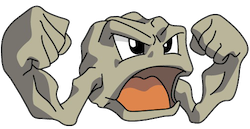

geodude
=======

A (hopefully) well tested, educational Python library for learning computational
geometry. Based on my reading of Springer's excellent `Computational Geometry <https://link.springer.com/book/10.1007%2F978-3-540-77974-2>`_,
amongst other resources on the internet. Algorithms implemented (and tested):

- Convex hulls:

  - QuickHull
  - Gift Wrapping (Jarvis)
  - Graham Scan
